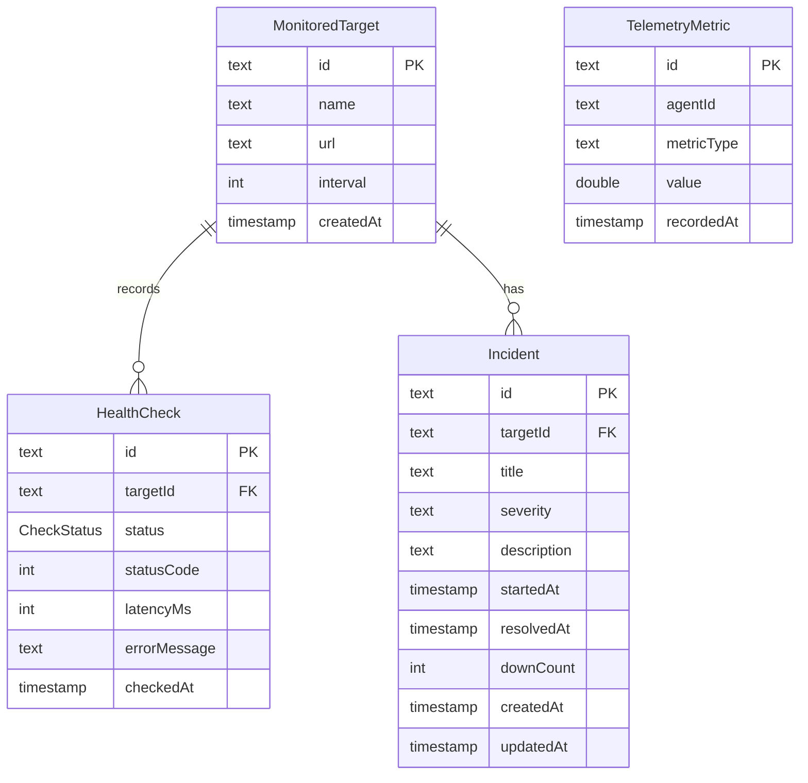
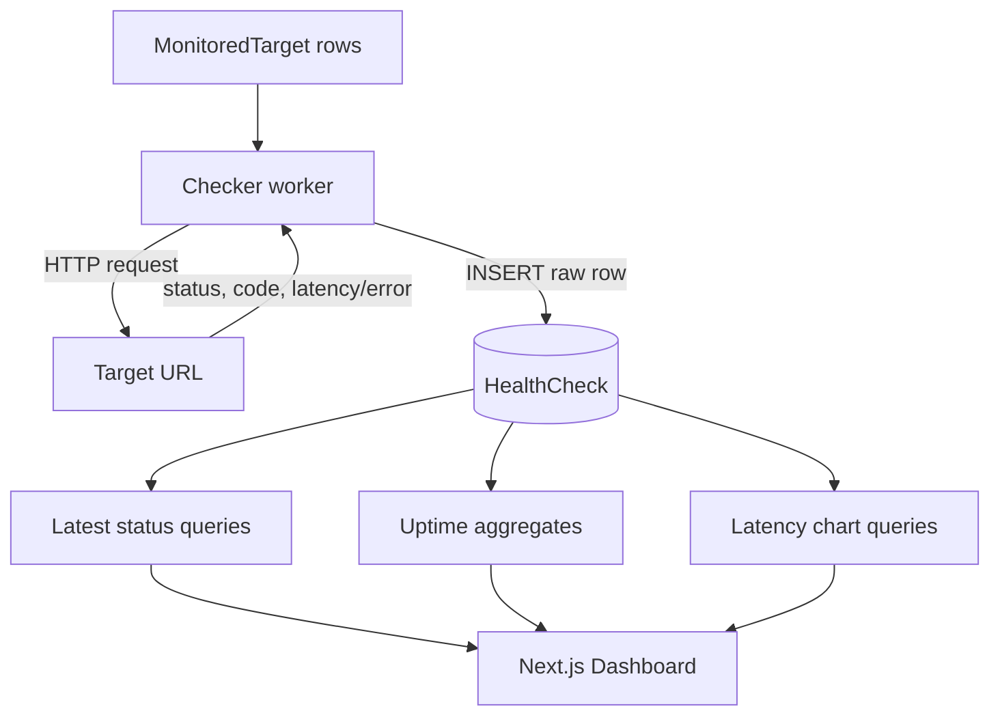
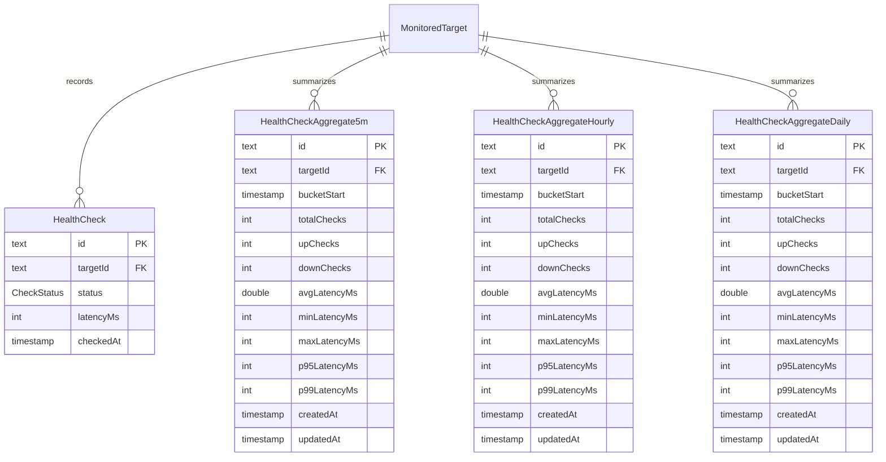
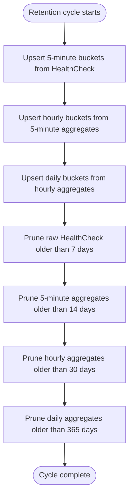
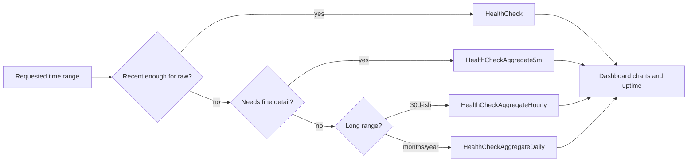
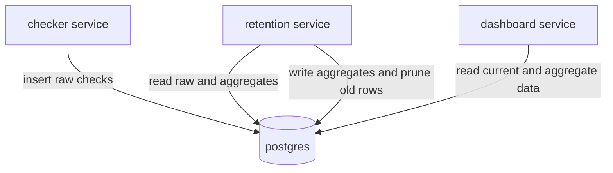

# Database Structure & Retention Rollups

This document describes Sentinel's current PostgreSQL schema and the planned rollup tables for long-term health-check retention.

The current database is optimized for writing raw checks and reading recent dashboard state. The planned retention worker adds precomputed aggregate tables so the dashboard can query longer time ranges without scanning the full `HealthCheck` table forever.

## Current Schema



### Tables

| Table | Purpose | Primary Access Pattern |
|---|---|---|
| `MonitoredTarget` | URLs that Sentinel checks. | Read by checker and dashboard. |
| `HealthCheck` | Raw result for every target check. | Appended by checker; queried by dashboard for latest state, charts, and uptime. |
| `Incident` | Stored incident records for target outages. | Queried by dashboard incident views. |
| `TelemetryMetric` | Host or agent metrics from the telemetry pipeline. | Written by collector; not part of health-check rollups yet. |

### Relationships

```text
MonitoredTarget
  ├─ HealthCheck[]  raw check history
  └─ Incident[]     outage records

TelemetryMetric is independent today and keyed by agentId, not targetId.
```

### Current Indexes

| Table | Index | Columns | Why It Exists |
|---|---|---|---|
| `HealthCheck` | `HealthCheck_checkedAt_idx` | `checkedAt` | Time-window scans and retention pruning. |
| `HealthCheck` | `HealthCheck_targetId_checkedAt_idx` | `targetId`, `checkedAt DESC` | Latest check per target and target-specific history. |
| `Incident` | `Incident_resolvedAt_idx` | `resolvedAt` | Active/resolved incident lookups. |
| `Incident` | `Incident_targetId_resolvedAt_idx` | `targetId`, `resolvedAt` | Incident history by target. |
| `Incident` | `Incident_startedAt_idx` | `startedAt` | Chronological incident views. |
| `TelemetryMetric` | `TelemetryMetric_agentId_metricType_recordedAt_idx` | `agentId`, `metricType`, `recordedAt` | Metric series queries. |

## Current Health-Check Flow



The checker writes one `HealthCheck` row per target check. Dashboard queries currently aggregate from raw `HealthCheck` rows for chart windows and uptime summaries.

## Why Rollups Are Needed

At a 2-minute interval, each target creates about 720 raw checks per day. With multiple targets, the raw table grows quickly:

```text
daily rows = target count * 2 checks per minute * 60 minutes * 24 hours
```

Raw checks are useful for recent debugging, but they become expensive and less necessary for older dashboard ranges. Rollup tables keep the important statistics while allowing old raw rows to be pruned.

## Planned Rollup Schema

The retention migration will add three aggregate tables:

| Planned Prisma Model | SQL Table | Bucket Size | Source |
|---|---|---|---|
| `HealthCheckAggregate5m` | `HealthCheckAggregate5m` | 5 minutes | Raw `HealthCheck` rows |
| `HealthCheckAggregateHourly` | `HealthCheckAggregateHourly` | 1 hour | 5-minute aggregate rows |
| `HealthCheckAggregateDaily` | `HealthCheckAggregateDaily` | 1 day | Hourly aggregate rows |

Each aggregate table should have the same logical shape:

| Column | Type | Notes |
|---|---|---|
| `id` | `TEXT` | Prisma CUID primary key, unless the migration chooses a composite primary key. |
| `targetId` | `TEXT` | Foreign key to `MonitoredTarget.id`. |
| `bucketStart` | `TIMESTAMP` | Start of the bucket, rounded down to the table granularity. |
| `totalChecks` | `INTEGER` | Count of all checks represented by the bucket. |
| `upChecks` | `INTEGER` | Count where status is `UP`. |
| `downChecks` | `INTEGER` | Count where status is `DOWN`. |
| `avgLatencyMs` | `DOUBLE PRECISION` nullable | Average latency; nullable because all source latencies can be null. |
| `minLatencyMs` | `INTEGER` nullable | Minimum non-null latency. |
| `maxLatencyMs` | `INTEGER` nullable | Maximum non-null latency. |
| `p95LatencyMs` | `INTEGER` nullable | 95th percentile non-null latency. |
| `p99LatencyMs` | `INTEGER` nullable | 99th percentile non-null latency. |
| `createdAt` | `TIMESTAMP` | Insert timestamp. |
| `updatedAt` | `TIMESTAMP` | Updated when a bucket is recomputed. |

Planned indexes per aggregate table:

| Constraint / Index | Columns | Purpose |
|---|---|---|
| Unique constraint | `targetId`, `bucketStart` | Makes each target/bucket idempotent and supports conflict updates. |
| Bucket index | `bucketStart` | Fast retention pruning and time-range scans. |
| Target bucket index | `targetId`, `bucketStart` | Fast chart queries for one target over time. |

## Planned Rollup Structure



## Planned Retention Worker

The new worker app will live at `apps/retention` and follow the checker app shape:

```text
apps/retention/
├── package.json
├── tsconfig.json
├── Dockerfile
└── src/
    ├── index.ts
    ├── scheduler.ts
    ├── db/
    │   └── prisma.ts
    ├── jobs/
    │   └── retention.ts
    └── logger/
        └── logger.ts
```

The worker will use the root `DATABASE_URL`, Prisma Client, `pino` logging, and raw SQL conflict updates for aggregate generation.

Default scheduling:

```text
startup
  └─ run full retention cycle immediately

every 5 minutes
  └─ run full retention cycle if no previous cycle is still running
```

The scheduler should use an in-memory `isRunning` guard so slow cycles do not overlap.

## Planned Retention Cycle



The aggregate jobs should run before pruning so no data is discarded before it has been summarized.

### Retention Windows

| Data | Keep For | Why |
|---|---:|---|
| Raw `HealthCheck` | 7 days | Recent debugging, latest status, short-range charts. |
| `HealthCheckAggregate5m` | 14 days | Detailed near-term charts without raw scans. |
| `HealthCheckAggregateHourly` | 30 days | Medium-range dashboard trends. |
| `HealthCheckAggregateDaily` | 365 days | Long-term uptime and latency history. |

## Aggregate SQL Shape

Rollups should skip the current incomplete bucket. Each job should recompute a look-back window and write by `targetId + bucketStart`, which makes reruns corrective instead of duplicative.

Example 5-minute bucket boundary:

```sql
date_trunc('hour', "checkedAt")
  + floor(date_part('minute', "checkedAt") / 5) * interval '5 minutes'
```

Example 5-minute aggregate shape:

```sql
WITH bucketed AS (
  SELECT
    "targetId",
    "status",
    "latencyMs",
    date_trunc('hour', "checkedAt")
      + floor(date_part('minute', "checkedAt") / 5) * interval '5 minutes'
      AS "bucketStart"
  FROM "HealthCheck"
  WHERE "checkedAt" < date_trunc('minute', now())
)
INSERT INTO "HealthCheckAggregate5m" (
  "id",
  "targetId",
  "bucketStart",
  "totalChecks",
  "upChecks",
  "downChecks",
  "avgLatencyMs",
  "minLatencyMs",
  "maxLatencyMs",
  "p95LatencyMs",
  "p99LatencyMs",
  "createdAt",
  "updatedAt"
)
SELECT
  gen_random_uuid()::text,
  "targetId",
  "bucketStart",
  count(*)::int,
  count(*) FILTER (WHERE "status" = 'UP')::int,
  count(*) FILTER (WHERE "status" = 'DOWN')::int,
  avg("latencyMs")::double precision,
  min("latencyMs")::int,
  max("latencyMs")::int,
  percentile_cont(0.95) WITHIN GROUP (ORDER BY "latencyMs")
    FILTER (WHERE "latencyMs" IS NOT NULL)::int,
  percentile_cont(0.99) WITHIN GROUP (ORDER BY "latencyMs")
    FILTER (WHERE "latencyMs" IS NOT NULL)::int,
  now(),
  now()
FROM bucketed
GROUP BY "targetId", "bucketStart"
ON CONFLICT ("targetId", "bucketStart") DO UPDATE SET
  "totalChecks" = EXCLUDED."totalChecks",
  "upChecks" = EXCLUDED."upChecks",
  "downChecks" = EXCLUDED."downChecks",
  "avgLatencyMs" = EXCLUDED."avgLatencyMs",
  "minLatencyMs" = EXCLUDED."minLatencyMs",
  "maxLatencyMs" = EXCLUDED."maxLatencyMs",
  "p95LatencyMs" = EXCLUDED."p95LatencyMs",
  "p99LatencyMs" = EXCLUDED."p99LatencyMs",
  "updatedAt" = now();
```

The real migration and job SQL should use the exact ID default available in the database. If Prisma keeps CUID defaults, the application can provide IDs or the migration can use an appropriate database-side default.

## Dashboard Query Direction

After rollups exist, dashboard reads can choose the smallest table that satisfies the requested range:



Suggested read strategy:

| UI Range | Preferred Source |
|---|---|
| Latest status and recent activity | Raw `HealthCheck` |
| Last 60 minutes to 24 hours | Raw `HealthCheck` or 5-minute aggregates |
| Last 7 to 14 days | 5-minute aggregates |
| Last 14 to 30 days | Hourly aggregates |
| Last 30 days to 1 year | Daily aggregates |

## Deployment Wiring

Production should run the retention worker as an internal-only service:



Planned deployment changes:

| File | Planned Change |
|---|---|
| `apps/retention/Dockerfile` | Worker image modeled after checker, no exposed port, `pgrep` health check. |
| `docker-compose.prod.yml` | Add `retention` on `sentinel-internal`, depend on healthy `postgres`, set `NODE_ENV=production` and `DATABASE_URL=${DATABASE_URL}`, publish no ports. |
| Root `package.json` | Add `retention:dev`, `retention:build`, and `retention:start`. |
| `update.sh` | Build and restart retention along with existing production services. |
| Docker build manifests | Copy the retention package manifest wherever workspace app manifests are enumerated. |

## Implementation Checklist

1. Add Prisma models for `HealthCheckAggregate5m`, `HealthCheckAggregateHourly`, and `HealthCheckAggregateDaily`.
2. Create a migration with aggregate tables, foreign keys to `MonitoredTarget`, unique constraints, and indexes.
3. Add `apps/retention` with scheduler, Prisma client, logger, and explicit retention jobs.
4. Implement aggregate writes in order: raw to 5-minute, 5-minute to hourly, hourly to daily.
5. Implement pruning after all aggregates complete successfully.
6. Add root package scripts and production Docker Compose service wiring.
7. Update dashboard queries to read rollups where useful.

